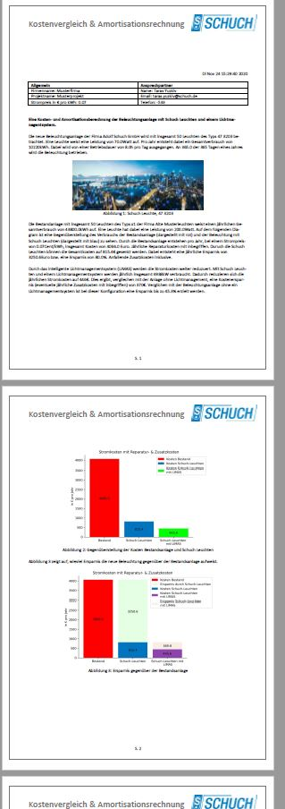

# Amortisations--und-Verbrauchstool-LED-Beleuchtung

# Was macht dieses Tool
Hierbei handelt es sich um ein Tool, welches dem Anwender folgende Möglichkeiten bietet:
- Verbrauch von LED-Leuchte
- Vergleich von konventioneollen Leuchten mit LED-Leuchten
- Amortisation von LED-Leuchten
- Verbrauch von LED-Leuchten mit und ohne Lichtmanagement 
- Amortisation von LED-Leuchten mit und ohne Lichtmanagement
- Erstellung einer .doc mit allen Informationen
- Erstellung und zusammensetzung einer .pdf mit allen Informationen
- Emissionsersparnis durch LED-Leuchten und Lichtmanagenet

Die App ist mit Python 3.7 implementiert worden. Die GUI ist mit PyQt5 umgesetzt worden.

# Aufbau der APP
Die App besteht insgesamt aus 5 Tabs. Man wird vom ersten bis zum letzten Tab entlang gefuhrt. Es ist nicht möglich Tabs zu überspringen. Durch die Buttons "zurück" und "weiter" kann zwischen den Tabs navigiert werden. Den Anwender kann in der App die Ergebnisse einsehen und diese anschließend in Form einer .pdf ausgeben. 

**Tab1:**  
Hier gibt es die Möglichkeit eine Bestandsanlage zum Vergleich aufzunehmen. Es gibt drei Modi: Kundenspezifisch, Industriebeleuchtung und Straßenbeleuchtung.   
Kundenspezifisch: hier sind alle Daten händisch einzugeben  
Industriebeleuchtung: hier wird anhand von Schichtarbeiten bzw. Arbeitstagen pro Woche berechnet werden wie die Anlage betrieben wird.  
Straßenbeleuchtung: bei dieser Anlagenart wird zusätzlich in drei Betriebsarten unterschieden: Ganznacht, Abschaltung spätnachts, Dimmung spätnachts. In abhängigkeit von den Angaben wird automatisch der durchschnittliche Zeitwert pro Tag berechnet. Dabei wird sind am Sonnenuntergang und Sonnenaufgang orientiert (+-15min).  
**Tab2:**  
Im zweiten Tab werden Angaben zu den Leuchten gemacht. Falls erwünscht auch Angaben zum Lichtmanagementsystem.  
**Tab 3:**  
Im dritten Tab werden genaue Angaben zum Betreiben des Lichtmanagementsystsems gemacht. Im ersgten Teil ist es möglich die Konfigutrationen der Bewegungsmelder anzugeben. Diese können zeitgleich durch eine Tageslichtanhängige Regelung gesteuert werden. Teil zwei macht es möglich Konfiguratioen der Anlage oder auch einen Teil der Anlage durch tageslichabhängige aufzunehmen. Der letzte Teil stellt die kalenderfunktion dar. Hier können zum Beispiel Ferientrage oder Tage an denen die Anlage komplett ausgeschaltet bleibt angegeben werden.  
**Tab 4**  
Im Tab 4 werden die berechnetetn Ergebnisse grafisch dargestellt.  
**Tab 5**  
Tab 5 erzeugt eine .doc und eine .pdf mit entsprechendem Text und Bildern der Ergebnisse.  

# Installation
Um die Bedienung möglichst einfach zu gestalten, wird dieses Tool als eine .exe zur verfügung gestellt. Diese .exe ist eine Installationsdatei welche ohne Adminrechte installiert werden kann. Die Installationsdatei wird durch "auto-py-to-exe" und "Inno Setup Compiler" erzeugt. 

# Updates
Beim Programstart wird überprüft ob die ausgeführte Version die aktuellste ist. Falls nein, wird die aktuellste Version vom Server Heruntergeladen, die installierte Version wird deinstalliert und die heruntergeladene installiert.

# GUI Screenshots
## Tab 1

## Tab 1 - Art der Anlage

## Tab 2 - Angaben zu den Leuchten

## Tab 3 - Angaben zum Lichtmanagement

## Tab 4 - Darstellung der Ergenisse

## Tab 5 - Erzeugung des Berichts

## .pdf Bericht

